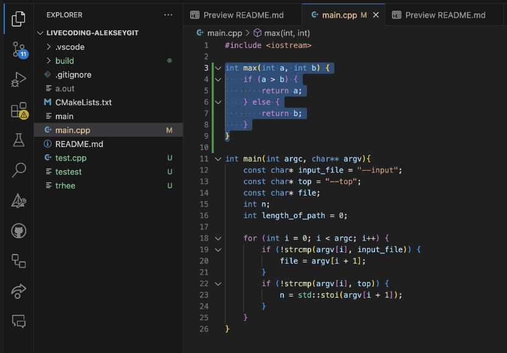
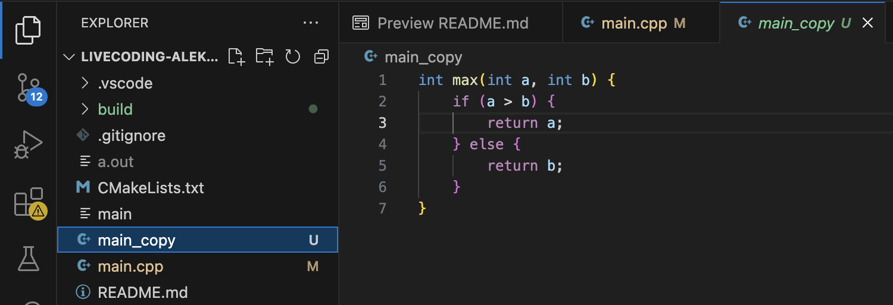
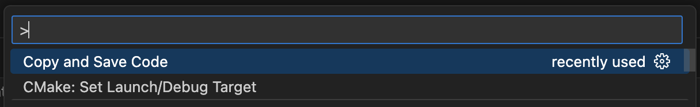
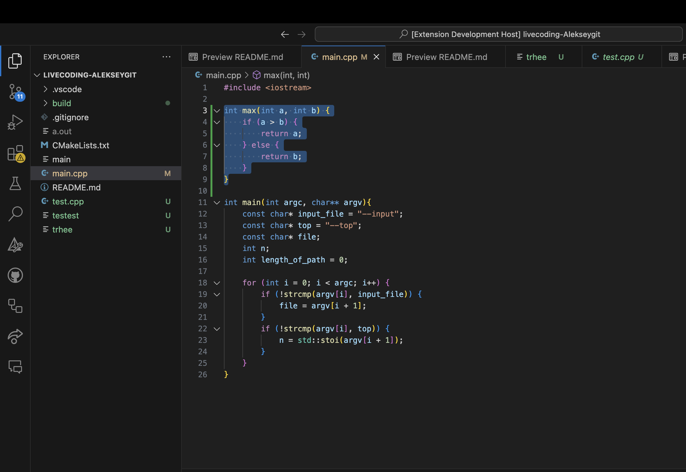

# File with copy of code creator

## Описание
Плагин реализован на **TypeScript** с использование **API Visual Studio Code**. Предназначен в первую очередь для проектов **Visual Studio Code** на **C++**. Он копирует выделенный код и сохраняет его в новый файл
### Основная функция расширения - копирование и вставка выделенной части кода



> Примечание: Плагин на данный момент реализован для языков c++, txt, js, python, typescript, но добавление любого другого языка в поддерживаемые делается очень просто.

## Технологии

- Язык реализации: **TypeScript**
- IDE: **Visual Studio Code**
- API: **Visual Studio Code Extension API**
- Целевой язык: **C++**


## Активация
В файл ***package.json*** добавлена команда *Detect dead code*.
```Typescript
commands": [
      {
        "command": "extension.copyAndSaveCode",
        "title": "Copy and Save Code"
      }
    ]
```
- "command": "extension.copyAndSaveCode" - добавляет в расширение команду.
- "title": "Copy and Save Code" - добавляет название, с которым она будет отображаться в палитре команд.

Для того, чтобы найти в своём коде неиспользумые функции или переменные при их наличии, нужно выполнить вызов команды *Copy and Save Code* в command palette.


## Реализация

### Структура:

- **package.json**: Содержит метаинформацию о плагине - его команды, настройки активации и зависимости.
- **src/extensions.ts**:  Содержит логику реализации плагина.
- **docs** : Содержит документацию и иллюстрационные изображения.
Это *главные* единицы структуры.

## Пример на коде

#### После выполнения работы создан новый файл со скопированной из изначального файла функцией

